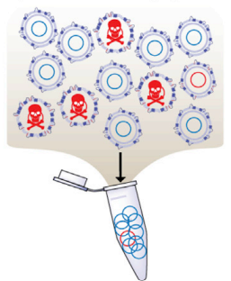

      

# Deep mutational scanning and machine learning uncover antimicrobial peptide features driving membrane selectivity 

Abstract:

Many antimicrobial peptides directly disrupt bacterial membranes but frequently also damage mammalian membranes. Deciphering the rules governing membrane selectivity is critical to understanding their function and enabling therapeutic use. Past attempts to decipher these rules often fail because they cannot interrogate adequate peptide sequence variation. To overcome this problem, we develop deep mutational surface localized antimicrobial display (dmSLAY), which reveals more comprehensive positional residue importance and flexibility across an antimicrobial peptide sequence. We apply dmSLAY to Protegrin-1, a potent yet toxic antimicrobial peptide, and identify thousands of sequence variants that positively or negatively influence its antibacterial activity. Further analysis reveals that avoiding aromatic residues and eliminating disulfide bound pairs while maintaining membrane bound secondary structure greatly improves Protegrin-1 bacterial specificity. Moreover, our biochemical datasets then enabled machine learning models to accurately predict membrane specific activities for over 5.7 million Protegrin-1 variants, leading to the identification of one with greatly reduced toxicity and retention of activity in a murine intraperitoneal infection model. Our results describe an innovative approach for elucidating antimicrobial peptide sequence-structure-function relationships which can inform synthetic peptide-based drug design.

Here we describe all the steps required to reproduce the analysis on the paper "Deep mutational scanning and machine learning uncover antimicrobial peptide features driving membrane selectivity".[link](https://www.ncbi.nlm.nih.gov/pmc/articles/PMC10543523/)  

# Workflow

This work flow is divided in 2 parts. Deep mutational scanning and Machine Learning.

## Part 1 - Deep Mutational Scanning

### Get Counts

One can run the script [getCounts.sh](https://github.com/ziul-bio/DMS_ML_AMP/blob/main/scripts/01_getCount.sh) to obtain the read count matrix for each sample.  
To run this script you will need [seqkit](https://bioinf.shenwei.me/seqkit/) and [flexbar](https://github.com/seqan/flexbar) installed in a unix enviromet.  

**Note: Since tha raw FASTQ files are larger the limit size allowed in github, they are not available yet, this script will not work.**

### Compute Changes in the Peptides Sequence

We translated the peptide sequences with the [biopython translate function](https://biopython.org/docs/1.75/api/Bio.Seq.html), and compute the differences on the sequence with the reference protegrin-1 protein using a custom python script, described on [translate_and_compute_changes_in_peptides.ipynb](https://github.com/ziul-bio/DMS_ML_AMP/blob/main/02_translate_peptides_and_stack.ipynb).

### Differential Expression Analysis

The differential analysis was done in R with [Deseq2](https://bioconductor.org/packages/release/bioc/html/DESeq2.html), described in the notebook [deseq2_analysis.rmd](https://github.com/ziul-bio/DMS_ML_AMP/blob/main/03_Analyse_Deseq2.Rmd).  

This section requires the reads count matrix obtain with the script getCounts.sh and are stored at "/results/counts_matrix_stacked.csv", the notebook and script will read the file and run the differential analysis. This run should genarate the log2 fold change and pvalues to all 7104 peptides.

## Part 2 - Machine Learning

### The notebooks 04 throught 06 shown the procedure used to train and test the model.

#### [Hemolysis Model](https://github.com/ziul-bio/DMS_ML_AMP/blob/main/04_hemolysis_model_v01.ipynb)
#### [Selectivity Model](https://github.com/ziul-bio/DMS_ML_AMP/blob/main/05_Selectivity_model_v01.ipynb)
#### [Activity Model](https://github.com/ziul-bio/DMS_ML_AMP/blob/main/06_Activity_model_v01.ipynb)

#### All these 3 models work in concensus to make the final predictions described in notebook [AMP Predictions](https://github.com/ziul-bio/DMS_ML_AMP/blob/main/07_AMP_predictions_v01.ipynb)

# To create a conda enviroment with all the requeriment package run:
    conda env create -f environment.yml -n DMS_ML_AMP

All the code are commented so feel free to change the parameters to suit your data and needs.
